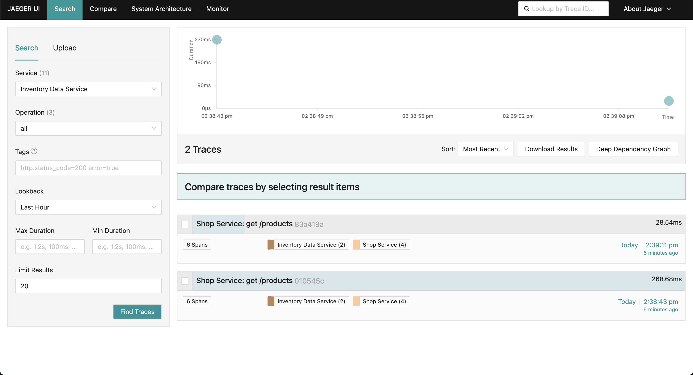
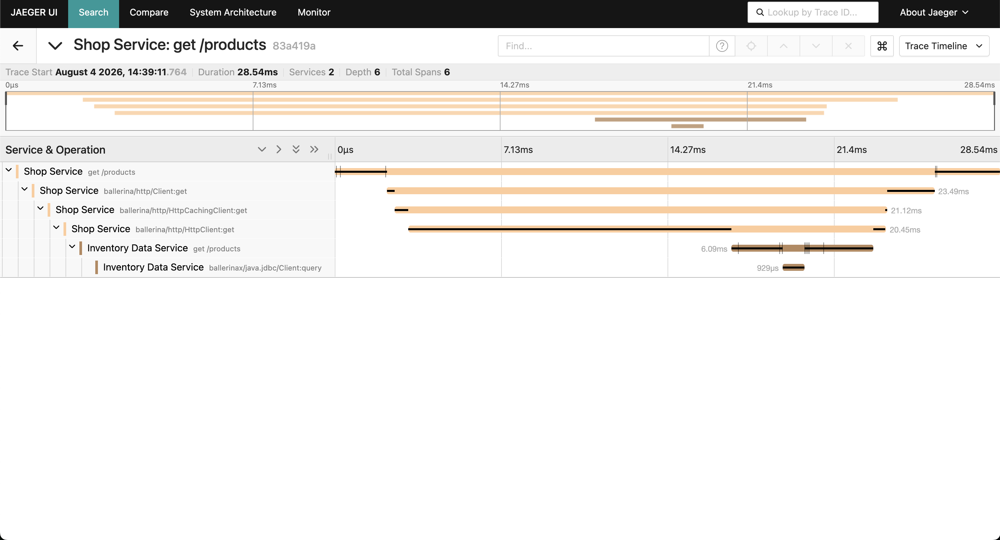

# Shop Tracing Demo

Two Ballerina services with distributed tracing (Jaeger) and metrics (Prometheus) enabled.

```
Client
  └─► shop-service          (port 8090)
          └─► inventory-data-service  (port 8091)
                  └─► H2 database (create-database/resources/shop_data)
```

## Services

| Service | Port | Description |
|---|---|---|
| `shop-service` | 8090 | HTTP front-end that clients call |
| `inventory-data-service` | 8091 | Stores and fetches data from a local H2 database |

## Setup

### 1. Create the database

```bash
cd create-database
bal run
```

### 2. Start inventory-data-service

```bash
cd inventory-data-service
bal run
```

### 3. Start shop-service

```bash
cd shop-service
bal run
```

## API Endpoints

### Shop Service (port 8090)

| Method | Path | Description |
|---|---|---|
| GET | `/shop/products` | List all products |
| GET | `/shop/products/{id}` | Get a single product |
| POST | `/shop/orders` | Place an order |
| GET | `/shop/orders` | List all orders |

Use `shop-service/shop-request.http` to send sample requests.

### Inventory Data Service (port 8091)

| Method | Path | Description |
|---|---|---|
| GET | `/inventory/products` | List all products from DB |
| GET | `/inventory/products/{id}` | Get a single product from DB |
| POST | `/inventory/orders` | Create an order in DB |
| GET | `/inventory/orders` | List all orders from DB |

## Observability

Both services export traces to Jaeger (OTLP gRPC on `localhost:4317`) and expose Prometheus metrics.

To see traces, start a Jaeger all-in-one container:

```bash
docker run -d --name jaeger \
  -p 16686:16686 \
  -p 4317:4317 \
  jaegertracing/all-in-one:latest
```

Then open `http://localhost:16686` and select `nipunal/shop_service` or `nipunal/inventory_data_service` from the service dropdown.

The `inventoryServiceUrl` in `shop-service/Config.toml` can be changed to point to a remote instance.

## Distributed Tracing in Jaeger

### Traces across multiple applications

The Jaeger search view groups all spans belonging to the same end-to-end request into a single trace entry. Each trace shows the two participating services — **Shop Service** and **Inventory Data Service** — and how long the overall request took.



Each row in the results represents one invocation of `GET /shop/products`. The coloured badges confirm that both services contributed spans to that single trace, giving a cross-service view of every request that flows through the system.

### Span inheritance (parent–child hierarchy)

Clicking a trace opens the timeline view, which reveals the full span tree for that request.



The hierarchy reflects the call chain:

```
Shop Service: get /products                         ← inbound HTTP request (root span)
  └─ Shop Service: ballerina/http/Client:get        ← outgoing HTTP call to inventory service
       └─ Shop Service: ballerina/http/HttpCachingClient:get
            └─ Shop Service: ballerina/http/HttpClient:get
                 └─ Inventory Data Service: get /products   ← span continues in the downstream service
                      └─ Inventory Data Service: ballerinax/java.jdbc/Client:query  ← SQL query span
```

Each child span is causally linked to its parent via the W3C `traceparent` header that Ballerina's HTTP client injects automatically on every outgoing call. The JDBC span at the leaf shows the time spent executing the database query, making it straightforward to identify latency at every layer.
