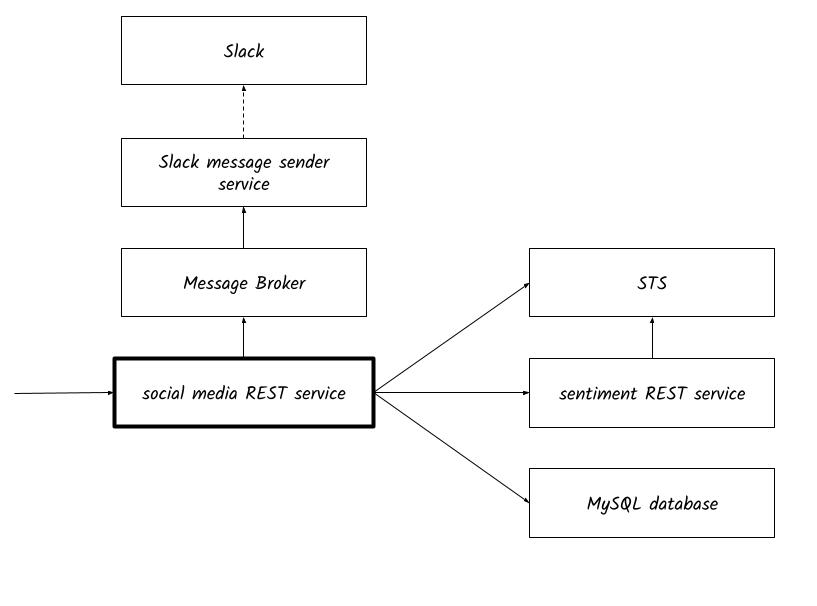
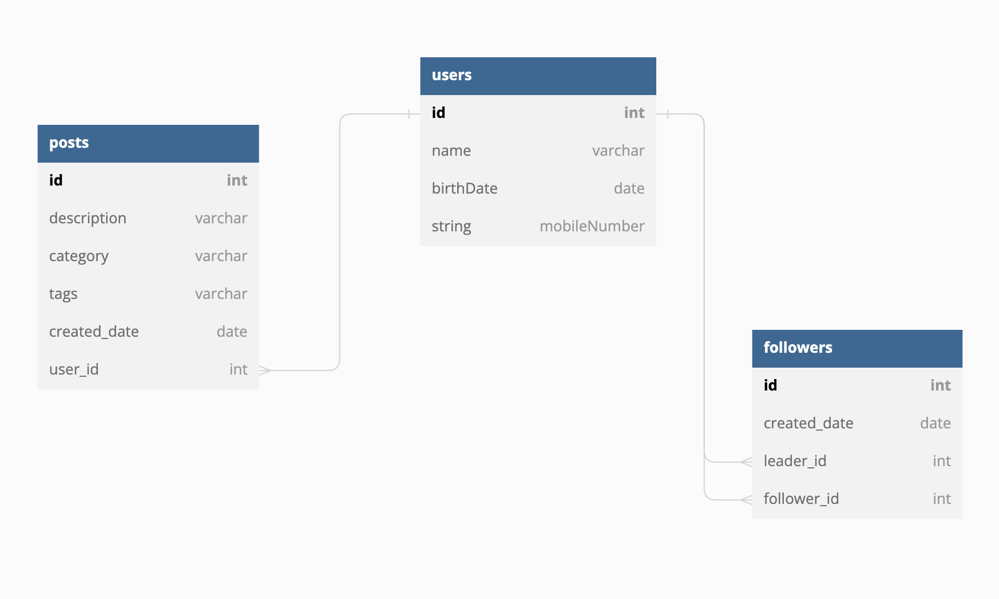

# [Ballerina] Social Media Service

The sample is based on a simple API written for a social-media site (like twitter) which has users, associated posts and followers. Following is the high level component diagram.



Following is the entity relationship diagram.



Following is the service description.

```ballerina
type SocialMedia service object {
    *http:Service;

    // users resource
    resource function get users() returns User[]|error;
    resource function get users/[int id]() returns User|UserNotFound|error;
    resource function post users(NewUser newUser) returns http:Created|error;
    resource function delete users/[int id]() returns http:NoContent|error;

    // posts resource
    resource function get users/[int id]/posts() returns PostMeta[]|UserNotFound|error;
    resource function post users/[int id]/posts(NewPost newPost) returns http:Created|UserNotFound|PostForbidden|error;
};
```

Following are the features covered by the scenario.

1. Writing REST APIs with verbs, URLs, data binding and status codes
2. Accessing databases
3. Configurability
4. Data transformation with the data mapper
5. HTTP client
6. Resiliency - Retry
7. Writing tests
8. Using connectors - Slack
9. OpenAPI specification, client stubs and central
10. Adding validations
11. Security - OAuth2
12. Error handlers
13. Ballerina concurrency
14. Integrating a message broker

# Setup environment

## With Docker Compose
1. Checkout the code base and move to the root folder
2. Execute `build-docker-images.sh` script to generate the necessary docker images.
3. Set environment variable `BALLERINA_NEW_RELIC_API_KEY`.
4. Execute `docker compose up`

>Note: When trying out feature 11 use port `9098` for the sentiment analysis endpoint.

## Without Docker Compose

### To complete up to feature 4
1. Setup a MySQL database
2. Execute the script `init.sql` in db-setup

### To complete up to feature 7
1. Move to `sentiment-analysis-service` and execute `BALLERINA_NEW_RELIC_API_KEY=<NEW_RELIC_LICENSE_KEY> bal run` to start sentiment analysis service

### To complete up to feature 11
1. Move to `sts-service` and execute `BALLERINA_NEW_RELIC_API_KEY=<NEW_RELIC_LICENSE_KEY> bal run` to start the Security Token Service (STS) service. The URL of the service is `https://localhost:9445/oauth2/token`
2. Move to `sentiment-analysis-service-secured` and execute `BALLERINA_NEW_RELIC_API_KEY=<NEW_RELIC_LICENSE_KEY> bal run` to start secured sentiment analysis service. Following are the OAuth2 details.

   clientId: `FlfJYKBD2c925h4lkycqNZlC2l4a`  
   clientSecret: `PJz0UhTJMrHOo68QQNpvnqAY_3Aa`  
   scope: `admin`  

>Note: When trying out feature 11 use port `9098` for the sentiment analysis endpoint.

### To complete up to feature 14
1. Setup a NATS server

# Try out
- Move to `social-media` and execute `BALLERINA_NEW_RELIC_API_KEY=<NEW_RELIC_LICENSE_KEY> bal run` to start social media service. 
- To send request open `social-media-request.http` file using VS Code with `REST Client` extension

# Observe in New Relic
[New Relic](https://newrelic.com/welcome-back) is a Software as a Service offering that focuses on performance and availability monitoring. 

Ballerina allows users to observe Ballerina Integrations on New Relic via `ballerinax/newrelic` [extension](https://github.com/ballerina-platform/module-ballerinax-newrelic). This extension provides both metrics and traces.

## Setup environment

1. Create an account and configure the API key in Newrelic:

> Go to Profile -> API keys -> Insights Insert key -> Insert keys to create an account in New Relic.

2. Set up `Config.toml` file in each service.

```toml
[ballerina.observe]
tracingEnabled=true
tracingProvider="newrelic"
metricsEnabled=true
metricsReporter="newrelic"

[ballerinax.newrelic]
apiKey="<NEW_RELIC_LICENSE_KEY>"    # Mandatory Configuration.
tracingSamplerType="const"          # Optional Configuration. Default value is 'const'
tracingSamplerParam=1               # Optional Configuration. Default value is 1
tracingReporterFlushInterval=15000  # Optional Configuration. Default value is 15000 milliseconds
tracingReporterBufferSize=10000     # Optional Configuration. Default value is 10000
metricReporterFlushInterval=15000   # Optional Configuration. Default value is 15000 milliseconds
metricReporterClientTimeout=10000   # Optional Configuration. Default value is 10000 milliseconds
```

User can configure the environment variable `BALLERINA_NEWRELIC_API_KEY` instead of `apiKey` in `Config.toml`.
If both are configured, `apiKey` in `Config.toml` will be overwritten by the environment variable value.

## View metrics
You can access the metrics that were published to the New Relic server in the New Relic [query builder](https://one.newrelic.com/data-exploration/query-builder). You can view the metrics query data in graphical format, as shown below. 

## View traces
You can access the traces that were published to the New Relic server in [New Relic traces](https://one.newrelic.com/distributed-tracing). You can view the metrics query data in graphical format, as shown below.
